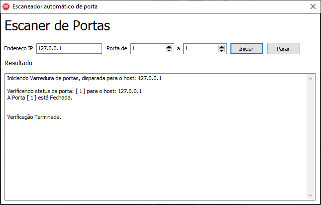

# Escaneador de portas TCP/IP feito em Delphi

# Propósito

O Windows Sockets 2 (Winsock) permite que os programadores criem aplicativos avançados de Internet, intranet e outros aplicativos compatíveis com a rede para transmitir dados de aplicativos através do fio, independente do protocolo de rede que está sendo usado. Com winsock, os programadores têm acesso aos recursos avançados de rede ® Microsoft® Windows® como multicast e Quality of Service (QoS).
 
# Mais Sobre Windows Sockets 2
https://docs.microsoft.com/en-us/windows/win32/winsock/windows-sockets-start-page-2?redirectedfrom=MSDN

# Função
Verificar quais portas no protocolo TCP/IP estão abertas, informando o host = IP

Make With love - @boscobecker
